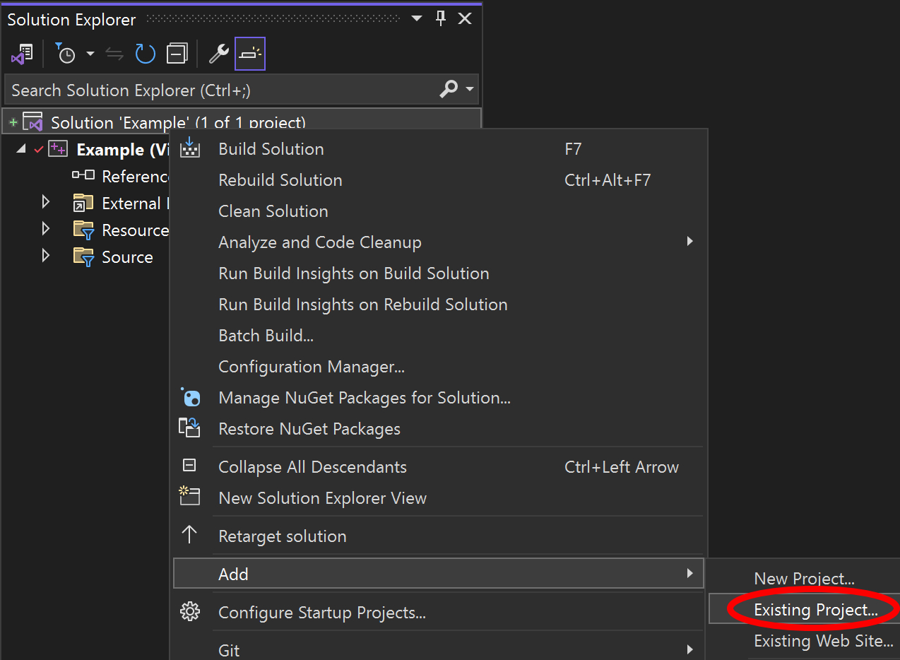

# ActiveLib

Foundational, platform-independent C++ classes for math, geometry, i/o and other utilities, applicable to any application development.

## Contents
1. [Scope](#scope)
2. [Installation](#install)
	- [Requirements](#require)
	- [Dependencies](#depend)
	- [Building](#build)
		- [Cmake](#cmake)
		- [Visual Studio](#vs)
		- [Xcode](#xcode)
3. [Using as Project Dependency](#projdep)
	- [As a Visual Studio Dependency](#vsdepend)
	- [As an Xcode Dependency](#xcodedepend)
4. Modules
	- [Container](./Active/Container/Container.md)
	- [Environment](./Active/Environment/Environment.md)
	- [Event](./Active/Event/Event.md)
	- [File](./Active/File/File.md)
	- [Geometry](./Active/Geometry/Geometry.md)
	- [Serialisation](./Active/Serialise/Serialisation.md)
	- [Setting](./Active/Setting/Setting.md)
	- [Utility](./Active/Utility/Utility.md)

## Scope 

This library is designed to be cross-platform, supporting Linux, iOS, macOS and Windows (including C++/CLR contexts). The base standard is currenty C++20 to allow broad compiler support.

## Installation 

### Requirements 

Compiler must support C++20

### Dependencies 

None

### Building 

The library can be built using a variety of tools. Unit tests build and run in each context:

|  |  |
| --- | --- |
| *Cmake* | Built against [DocTest](https://github.com/doctest/doctest) |
| *Visual Studio* | Run in [Test Explorer](https://learn.microsoft.com/en-us/visualstudio/test/run-unit-tests-with-test-explorer?view=vs-2022) |
| *Xcode* | Run with [XCTest](https://developer.apple.com/documentation/xctest) |

#### Cmake 

The following command-line instructions will build the library and tests:

	cmake -B ./build
	cmake --build ./build --config Release

> Note: Directing the output to a *build* directory is simply a practical suggestion, not a requirement. The build output can be directed anywhere.

For Visual Studio builds, it's prudent to specify a compiler and toolset, e.g.:

	cmake -B ./build/v143 -G "Visual Studio 17" -A x64 -DCMAKE_GENERATOR_TOOLSET=v143
	cmake --build ./build/v143 --config Release

Unit tests are built into a single executable called *activelibtests* and can be executed from the command-line, e.g.:

	./activelibtests

#### Visual Studio 

- Open ActiveLib.sln in Visual Studio 2022
- Pick the target Release17
- Click the menu Build > Build Solution
- Run unit tests by clicking Test > Run All Tests

#### Xcode 

- Open ActiveLib.xcworkspace in Xcode
- Pick the scheme ActiveLib-Release
- Click the menu Product > Build
- Run unit tests by clicking Product > Test

### Documentation 

The source contains Doxygen-style quotes for building a documentation set, which can be viewed [here](https://www.activethread.net/ActiveLib/Documentation/index.html).

Alternatively, the documentation can be built using the configuration file `./Documentation/Doxyfile`, either through the GUI application or from the command line: `doxygen ./Documentation/Doxyfile`

The latter will build the documentation into `./Documentation/html/`

### Using as IDE Project Dependency 

If ActiveLib is used as a dependency for an application within an IDE (VS or Xcode), the most convenient method is to embed the dependency directly into the parent solution/workspace so the library is automatically built and linked into the parent.

#### As a Visual Studio Dependency 

First add the ActiveLib project to your VS solution by right-clicking on the solution, picking *Add > Existing Project*, navigating to the ActiveLib project file and clicking *Open*.

{width=637}

The ActiveLib project should now appear in the solution explorer.

Next right-click on the *References* of the project to depend on ActiveLib and pick *Add Reference*. A dialog should appear with ActiveLib in a list - tick the adjacent check-box to add it as a reference.

{width=342}

The solution explorer should now include:
1. The ActiveLib project
2. ActiveLib17 (or 16) as a referenced library.

{width=342}

Any changes to ActiveLib should automatically build and link into your solution.

#### As an Xcode Dependency 

First add the ActiveLib project to your Xcode workspace by right-clicking on the workspace, picking *Add Files to "Workspace"…*, navigating to the ActiveLib project file and clicking Open.

{width= 342}

Then add ActiveLib to the target as a dependency:
1. Click on the workspace;
2. Select the relevant target;
3. Click *Build Settings*;
4. Expand *Target Dependencies*;
5. Click the + button;
6. Select ActiveLib.

{width=1069}

The ActiveLib project should now appear in the workspace hierarchy.

Then add the ActiveLib product library to be linked against the build. The first 3 steps are as above - then:
1. Expand *Link Binary With Libraries*;
2. Click the + button;
3. Select *libActiveLib.a*

{width=1069}

Any changes to ActiveLib should automatically build and link into your project.
